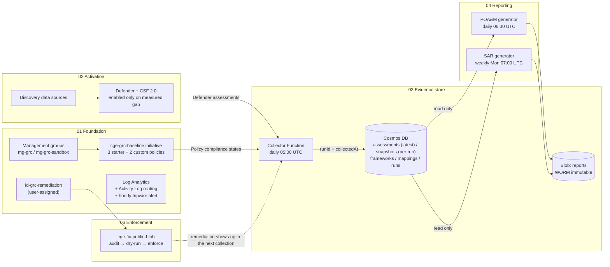
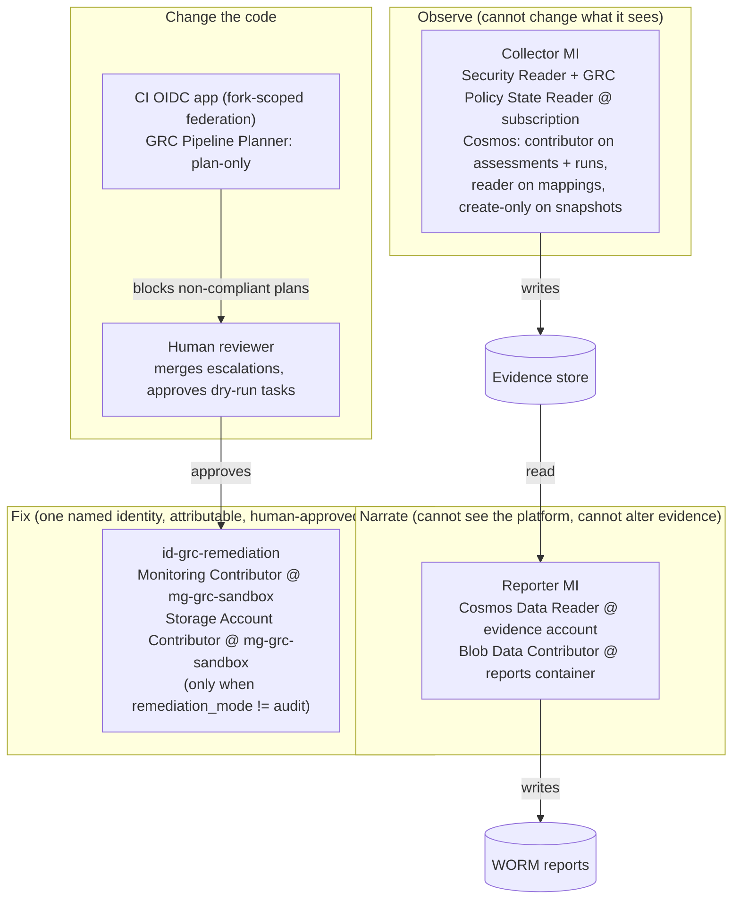

# Architecture

This pipeline turns a governed Azure subscription into continuously collected, tamper-proof
evidence and the reports an assessor asks for, then fixes what it finds through an identity
that can do nothing else. This document covers three things: how data flows through the
stages, where the identity boundaries sit, and why the non-obvious choices were made.

## Stage flow

Each stage is a Terraform root module with its own state file. A downstream stage reads an
upstream stage only through its declared outputs (`terraform_remote_state`), so a stage can
change its internals without breaking anything that depends on it.

The loop closes on the dotted line: a fix made in stage 06 changes the resource, Defender
re-assesses it, and the next collection records the new state with a fresh `runId`. Nothing
reports a fix that the evidence store has not independently observed.

Receipts for each flow in this diagram, with run IDs and timestamps: [EVIDENCE.md](EVIDENCE.md).

## Identity boundaries

No identity both records facts and writes the narrative about them, and no pipeline identity
holds Owner or Contributor on the governed scope.

| Identity | Can | Cannot | Why the split matters |
|---|---|---|---|
| Collector MI | Read Defender assessments and Azure Policy compliance states; upsert `assessments` and `runs`; read `mappings`; create (never replace) in `snapshots` | Change any resource; trigger scans or write exemptions; write reports | The recorder of facts cannot shape the story told about them |
| Reporter MI | Read Cosmos; write blobs in the `reports` container only | Read the platform; write evidence; touch any other container | Every report number must come from a stored document, so the reporter is denied any other source |
| Remediation identity | Write diagnostic settings (Monitoring Contributor); write storage account properties (Storage Account Contributor, only when `remediation_mode != audit`) | Read blob or Cosmos data; act anywhere outside `mg-grc-sandbox`; assign roles. Residual: Storage Account Contributor is broader than the one property the policy flips (it can change other account settings, list keys, or delete storage accounts); a custom read/write-only role is the production step | Filter the Activity Log by this caller and the complete history of automated change comes back; the tripwire flags every write by anyone else |
| CI OIDC app | Plan and gate every PR; nightly drift plan. Holds **GRC Pipeline Planner** at mg-grc (read plus refresh list actions) and blob data on the state RG. Validated live: every gate and drift plan since 2026-10-03 ran under it with no 403 | Create, modify, or delete any resource; write RBAC; exist anywhere but the fork that armed it | Zero stored secrets, and a compromised workflow dependency holding the token can look but not touch. Residual risk: it can list keys for the two `internal` runtime accounts, while keys authenticate nothing against evidence (shared keys and Cosmos local auth are off) |

Every secret-shaped thing in this design is an identity instead: the evidence storage account
disables shared keys, Cosmos disables local auth, and CI exchanges short-lived OIDC tokens.

## Why the non-obvious choices

- **Discovery before activation.** Stage 02 reads the current tier of every baseline
  Defender plan (`azapi` data source) before it declares anything, and exports the gap as
  an output. The activation resource is keyed on the baseline list, not on the live tiers:
  keying resources on values the same apply is about to change makes the next run destroy
  what it just enabled. Terraform then changes only the plans that differ, so on a
  subscription already at the baseline the plan is empty, and the gap output says why.
- **Two sources, one sweep.** Defender assessments and Azure Policy compliance states
  for this pipeline's own assignments land under the same `runId`, normalized to one
  status vocabulary, so the reports need no special cases. Without the policy source,
  findings from the custom controls would stay in Azure Policy and never reach the
  evidence store or the POA&M.
- **Latest state, per-run snapshots, and a ledger, because upserts forget.** Findings
  upsert on deterministic IDs, so `assessments` holds the latest state of each (with
  `firstSeenAt`, which starts the POA&M clock). Every sweep also writes an append-only
  copy into `snapshots`, partitioned by `runId`. The collector's role on that container
  is a custom create-and-read role with no replace or upsert, so a past run's partition
  cannot be rewritten even by the collector's own code, and a report reproduces from its `runId` indefinitely and a sweep that
  fails partway cannot disturb the last good run. The `runs` container keeps one record
  per sweep, including failed ones, and the reports pin to the latest *succeeded* run.
- **Collect once, crosswalk as data.** One assessment document serves every framework through
  the `mappings` container. Adding a framework is a data change, not a code change.
- **WORM on reports, versioning on state.** Reports are evidence and must be immutable. State is
  working data and must be recoverable. Each gets the protection that fits its job.
- **Escalation is a one-line reviewed diff.** `remediation_mode` moves audit → dry-run → enforce
  only through a merged PR. Automation acts; humans authorize.
- **Data classification as a first-class control.** In healthcare the first assessor question
  about any data store is what it holds and who can reach it. `cge-require-data-classification`
  (Audit) makes every store declare its class; `cge-deny-public-network-restricted` (Deny) keeps
  a `restricted` store off the public internet. The repo gate (`classification.rego`) applies
  the same vocabulary before merge, and the pipeline's own stores are classified under it.
  Deny was earned on the second policy because the rule is binary and the label is
  self-declared; the first stays Audit until the inventory is clean.
- **CI can plan, never apply.** The gate and drift workflows only run `terraform plan`, so
  the CI identity holds a custom plan-only role instead of Contributor. Every action in
  every workflow is pinned to a full commit SHA, and conftest and gitleaks are release
  binaries checked against their published checksums, because a job holding a cloud
  token is exactly what a moved action tag goes looking for.
- **The deployer is named, not inferred.** Stage 03 grants its data-plane roles to
  `deployer_object_id`, falling back to the caller only for a local apply. CI passes the
  human deployer's ID, so a plan run as the CI identity matches state instead of
  proposing to move those grants to itself and raising a false drift issue every night.
- **Two drift detectors, because a nightly plan only sees the end state.** `drift.yml`
  compares reality to code every night and fails the run on any difference. The
  tripwire (`stages/01-foundation/tripwire.tf`) watches the Activity Log hourly for the
  act itself and names the caller. Human applies fire it too, on purpose: the alert is
  the prompt to match each change to a merged PR. The nightly detector once ran green
  through a deliberate out-of-band change because the Terraform wrapper hid plan exit
  code 2; the fix and the reasoning are in PR #10, and the job now treats a detector
  that cannot run as a failure, not a clean result.
- **Synthetic data only.** Nothing in this sandbox is real patient data. The `restricted` tier
  exists to prove the guardrail, not to hold PHI.
